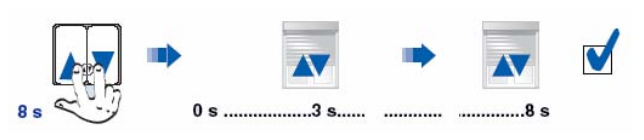
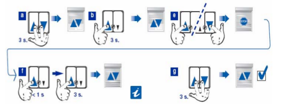

# byme-somfy-ctrl

Control the Somfy blinds motor with VIMAR By-me actuator

I have the Somfy Oximo WT blinds motor that are controlled by VIMAR home automation system.

Sometimes, to do maintenace, I need to reset the blinds limit configuration of motor to manually move blinds up and down.

So I've created this wizard that must be run on [Raspberry Pi](https://www.raspberrypi.org/) connected to home automation bus with [VIMAR 01847 KNX Usb Interface](https://www.vimar.com/it/it/catalog/product/index/code/01993) using [this driver](https://github.com/giursino/KnxInterfaceVIMAR01847).

## Somfy Oximo WT specs

Reference: [PDF](doc/oximo50_wt_im_it06.pdf)

1. Reset motor using this procedure

   
   
2. Setup blinds limit using this procedure

   
   
## VIMAR By-me specs

Actuator device: [01470.1](https://www.vimar.com/it/it/catalog/product/index/code/01470.1)

KNX-USB interface: [01847](https://www.vimar.com/it/it/catalog/product/index/code/01993)

1. Reset blinds configuration
2. Setup actuator configuration to use single relay manually
3. Use it to setup somfy motor
4. Restore previous configuration

# Run

* connect to Raspberry Pi
* install [KnxInterfaceVIMAR01847](https://github.com/giursino/KnxInterfaceVIMAR01847)
* connect VIMAR 01847 to the USB of the Raspberry Pi and to the Home Automation bus
* detect:
  * the By-me device type (ex: `01470.x`)
  * the By-me device address (ex: `0x2005`)
  * the Functional Block index of blinds actuator connected to Somfy blinds motor (ex: `0x25`)
* run `byme-somfy-ctrl.sh` and follow the wizard

## My home setup

Room         | Device type | Device address  | Functional-block id
-------------|-------------|-----------------|--------------------
Cam. matr.   | 01470       | 2005            | 22
Cucina ovest | 01470       | 2005            | 23
Bagno notte  | 01470       | 2005            | 24
Cameretta    | 01470       | 2005            | 25
Cucina sud   | 01470       | 2006            | 22
Sogg. sud    | 01470       | 2006            | 23
Bagno giorno | 01470       | 2006            | 24
Studio       | 01470       | 2006            | 25
